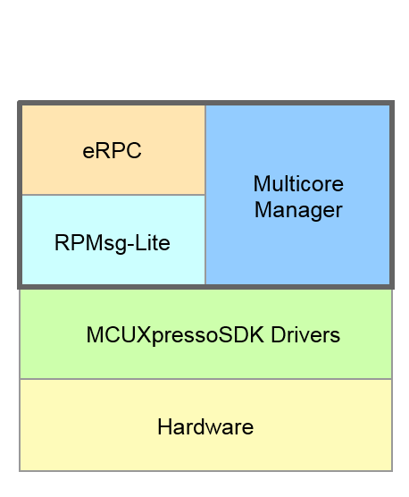

MCMGR Component                         {#mainpage}
===============

The Multicore Manager (MCMGR) software library provides a number of services for multicore systems. This library is distributed as a part of the Multicore SDK (MCSDK). Together, the MCSDK and the MCUXpresso SDK (SDK) form a framework for development of software for NXP multicore devices.

The MCMGR component is located in the &lt;MCUXpressoSDK_install_dir&gt;/middleware/multicore/mcmgr directory.

The Multicore Manager provides the following major functions:

- Maintains information about all cores in system.
- Secondary/auxiliary core(s) startup and shutdown.
- Remote core monitoring and event handling.

# Usage of the MCMGR software component {#usage}

The main use case of MCMGR is the secondary/auxiliary core start. This functionality is performed by the public API function.

Example of MCMGR usage to start secondary core:

~~~~~{.c}
#include "mcmgr.h"

void main()
{
    /* Initialize MCMGR - low level multicore management library.
       Call this function as close to the reset entry as possible,
       (into the startup sequence) to allow CoreUp event triggering. */
    MCMGR_EarlyInit();

    /* Initialize MCMGR, install generic event handlers */
    MCMGR_Init();

    /* Boot secondary core application from the CORE1_BOOT_ADDRESS, pass "1" as startup data, starting synchronously. */
    MCMGR_StartCore(kMCMGR_Core1, CORE1_BOOT_ADDRESS, 1, kMCMGR_Start_Synchronous);
.
.
.
    /* Stop secondary core execution. */
    MCMGR_StopCore(kMCMGR_Core1);
}
~~~~~

Another important MCMGR feature is the ability for remote core monitoring and handling of events such as reset, exception, and application events.
Application-specific callback functions for events are registered by the MCMGR_RegisterEvent() API. Triggering these events is done using the MCMGR_TriggerEvent() API.
mcmgr_event_type_t enums all possible event types.

An example of MCMGR usage for remote core monitoring and event handling.
Code for the primary side:

~~~~~{.c}
#include "mcmgr.h"

#define APP_RPMSG_READY_EVENT_DATA  (1)

uint16_t RPMsgRemoteReadyEventData = 0;

/* Callback function registered via the MCMGR_RegisterEvent() and triggered by MCMGR_TriggerEvent() called on the secondary core side */
void RPMsgRemoteReadyEventHandler(uint16_t eventData, void *context)
{
    RPMsgRemoteReadyEventData = eventData;
}

void main()
{
    /* Initialize MCMGR - low level multicore management library.
       Call this function as close to the reset entry as possible,
       (into the startup sequence) to allow CoreUp event triggering. */
    MCMGR_EarlyInit();

    /* Initialize MCMGR, install generic event handlers */
    MCMGR_Init();

    /* Register the application event before starting the secondary core */
    MCMGR_RegisterEvent(kMCMGR_RemoteApplicationEvent, RPMsgRemoteReadyEventHandler, NULL);

    /* Boot secondary core application from the CORE1_BOOT_ADDRESS, pass rpmsg_lite_base address as startup data, starting synchronously. */
    MCMGR_StartCore(kMCMGR_Core1, CORE1_BOOT_ADDRESS, (uint32_t)rpmsg_lite_base, kMCMGR_Start_Synchronous);

    /* Wait until the secondary core application signals the rpmsg remote has been initialized and is ready to communicate. */
    while(APP_RPMSG_READY_EVENT_DATA != RPMsgRemoteReadyEventData) {};
.
.
.
}
~~~~~

Code for the secondary side:

~~~~~{.c}
#include "mcmgr.h"

#define APP_RPMSG_READY_EVENT_DATA  (1)

void main()
{
    /* Initialize MCMGR - low level multicore management library.
       Call this function as close to the reset entry as possible,
       (into the startup sequence) to allow CoreUp event triggering. */
    MCMGR_EarlyInit();

    /* Initialize MCMGR, install generic event handlers */
    MCMGR_Init();
.
.
.

    /* Signal the to other core that we are ready by triggering the event and passing the APP_RPMSG_READY_EVENT_DATA */
    MCMGR_TriggerEvent(kMCMGR_RemoteApplicationEvent, APP_RPMSG_READY_EVENT_DATA);
.
.
.
}
~~~~~

# MCMGR Data Exchange Diagram {#data_exchange_diagram}

The following picture shows how the handshakes are supposed to work between the two cores in the MCMGR software.

# Revision History {#revision_history}

This table summarizes revisions of this document.

|Revision number| Date    |Substantive changes                       |
|---------------|---------|------------------------------------------|
|1.0            | 09/2016 | Initial release                          |
|2.0.1          | 02/2017 | Minor updates for the SDK Rel6           |
|3.0.0          | 08/2017 | API changes: 
 - Removed MCMGR_LoadApp(), MCMGR_MapAddress() and MCMGR_SignalReady() 
 - Modified MCMGR_GetStartupData() 
 - Added MCMGR_EarlyInit(), MCMGR_RegisterEvent() and MCMGR_TriggerEvent() 

 Added the ability for remote core monitoring and event handling|
|4.0.0          | 02/2018 | Added new MCMGR_TriggerEventForce() API  |
|4.0.1          | 05/2018 | Code formating, removed unused code      |
|4.0.2          | 09/2018 | Align porting layers to the updated MCUXpressoSDK feature files      |
|4.0.3          | 05/2019 | Minor code adjustments based on static analysis tool findings      |
|4.1.0          | 11/2019 | Code adjustments to address MISRA C-2012 Rules      |

